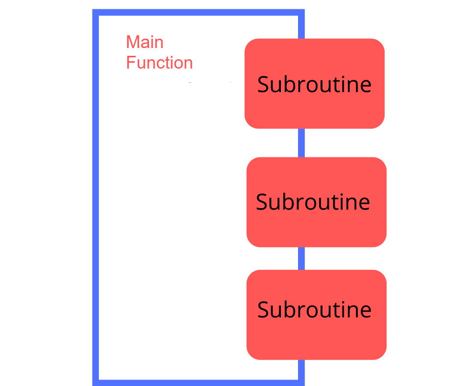
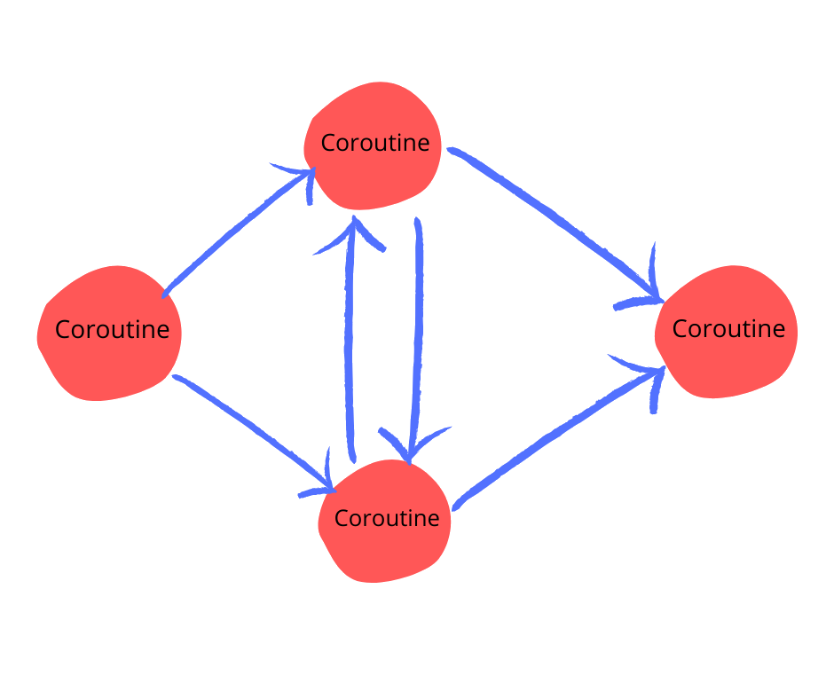

### If you don't know about What generator is ? Please have a look at <a href="/post/python/generator/">this</a> post.

# Let’s, deep dive!

## Understanding Subroutine



When the logic for a function with complex behavior is divided into several small steps that are themselves functions, these functions are called `helper functions` or `subroutines`. Subroutines are called by the main function that is responsible for coordinating the use of several subroutines.

## Understanding Coroutine

There is another approach for dividing or decomposing a complex program. In the above approach, we have only one entry point, the main function. Using `coroutines` we will have one entry point but `multiple re-entry points`. When using coroutines, there is no main function to coordinate results. Instead, coroutines themselves link together to form a `pipeline`. There may be a coroutine for consuming the incoming data and sending it to other coroutines. There may be coroutines that each do simple processing steps on data sent to them, and there may finally be another coroutine that outputs a final result.



Let’s explore how python supports building coroutines with the **yield** and **send()** statements.

So far we have seen that python generator function **yield** a value. But it can also consume a value using **(yield)**. Apart from yield and next(), the generator object also have **send()** and **close()** functions.

```python

>>> value = (yield)

```
###### [PEP 342](https://www.python.org/dev/peps/pep-0342) explains the exact rules, which are that a yield-expression must always be parenthesized except when it occurs at the top-level expression on the right-hand side of an assignment.

With this statement, execution pauses until the object's send method is invoked with an argument

```python

>>> coroutine.send(data)

```

Then, execution resumes, with the value being assigned to the value of data.

### Let’s look at an example to clarify things up:

We will design two functions. The first function `emit_word()` will `produce` words from the given input string and `emit/send` our second function `pattern()` will `consume` the input word and will give the output if a pattern `p` is in the `input word`.

### Consumer:
```python
# Consumer
>>> def pattern(p):
        print(f"Searching for {p}")
        try:
            while True:
                s = (yield)
                if p in s:
                    print(s)
        except GeneratorExit:
            print("=== Completed ===")
```

### Examining the consumer functioin:

```python

>>> p = pattern("apple")
>>> next(p)
Seraching for apple
# The generator function will pause until send() is called.
>>> p.send("An apple a day keeps the doctor away")
An apple a day keeps the doctor away
>>> p.send("A strawberry a day keeps the doctor away")
>>> p.send("My mom gave me an apple")
My mom gave me an apple
>>> p.close()
===Completed===
```

### Producer:

```python
#Producer
>>> def emit_word(string, match):
        for word in string.split():
	          match.send(word)
        match.close()
```

### Examining the producer functioin:

For each word in a given string it emits/send the word to the consumer function

### Joining all together:

```python
>>> string = "Pen Pineapple apple pen"
>>> match = pattern("apple")
>>> next(match)
Seraching for apple
>>> emit_word(string, match)
Pineapple
apple
===Completed===
```

# Key takeaways: generators

* Generators produce values one-at-a-time as opposed to giving them all at once.
* There are two ways to create generators: generator functions and generator expressions.
* Generator functions yield, regular functions return.
* Generator expressions need (), list comprehensions use [].
* You can only use generator expressions once.
* There are two ways to get values from generators: the next() function and a for loop. The for loop is often the preferred method.
* We can use generators to read huge files to give us one line at a time. By not loading everything in memory at once.